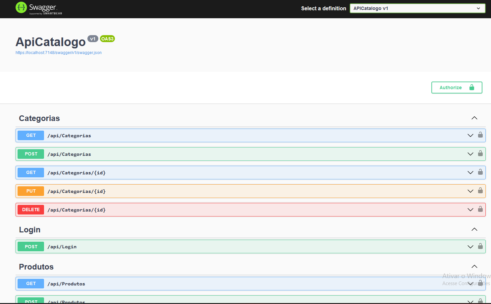

<h1 align="center"> APICatalogo </h1>

<p align="center"> It's a simple products CRUD API using Controllers.</p>

## 📽 Preview




## 💻 Main Technologies

- [Visual Studio 2022](https://visualstudio.microsoft.com/pt-br/vs/community/)
- [ASP.NET Core 8.0](https://learn.microsoft.com/pt-br/aspnet/core/?view=aspnetcore-8.0)
- [Entity Framework Core](https://learn.microsoft.com/pt-br/ef/)
- [SQLite](https://www.sqlite.org/index.html)

## 🔥 Getting Started

```sh
# clone repo
$ git clone https://github.com/lucaseverest/APICatalogo.git
```

<p>Open the project in Visual Studio 2022</p>

<p>Run the following command in the Package Manager Console to instance the SQLite Database.</p>

```sh
Update-Database
```

<p>To start the project without debugging press Ctrl + F5 </p>

<p>Login: lucas	| Password: 123456</p>

The application Swagger can be accessed at [`localhost:7148/swagger/index.html`](https://localhost:7148/swagger/index.html).